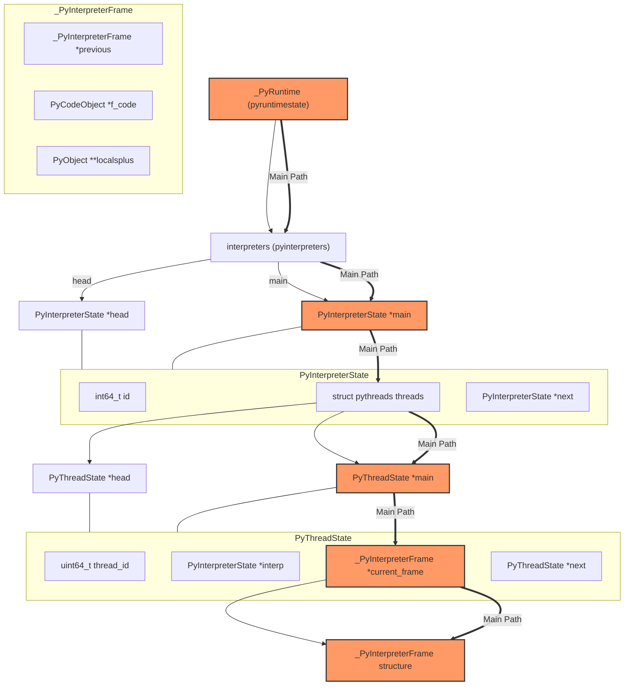

Python 3.14 目前主要的一些主要的特性其实已经固定了，在我看来，Python 3.14 是一个未来很多年的一个核心版本。因为其确定了是时代的 Python
调试生态的基准，这篇文章将会来聊聊这个 Python 世界中的史诗级改进

<!--more-->

## 正文

在我们日常调试 Python 代码的时候，我们经常会遇到这样一个问题，我们需要采样当前的 Python Runtime 的状态，进而进一步调试我们的 Python 进程

常见的手段莫过于两种

1. 通过 eBPF + UProbe 等手段来触发
2. 通过 `process_vm_readv` 等 Syscall 来直接整块读取内存

无论这两种方式都有一个核心的问题，我们怎么样来解析内存中的数据？

用 <https://github.com/jschwinger233/perf-examples/blob/main/cpython310_backtrace/bpf.c> 来做一个例子，在之前的很多年的时候，我们会怎么做

```c
#define PAGE_SIZE (1<<12)
#define KASAN_STACK_ORDER 0
#define THREAD_SIZE_ORDER (2 + KASAN_STACK_ORDER)
#define THREAD_SIZE  ((__u64)(PAGE_SIZE << THREAD_SIZE_ORDER))
#define TOP_OF_KERNEL_STACK_PADDING ((__u64)0)

const static u32 ZERO = 0;

struct PyTypeObject {
    char _[24];
    char *tp_name;
};

struct PyObject {
    char _[8];
    struct PyTypeObject *ob_type;
};

struct PyVarObject {
    struct PyObject ob_base;
    char _[8];
};

struct PyASCIIObject {
	__u8 _[16];
	__u64 length;
	__u8 __[24];
};

struct _PyStr {
    struct PyASCIIObject ascii;
    char buf[100];
};

struct PyCodeObject {
    char _[104];
    struct _PyStr *co_filename;
    struct _PyStr *co_name;
};

struct PyFrameObject {
    struct PyVarObject ob_base;
    struct PyFrameObject *f_back;
    struct PyCodeObject *f_code;
    char _[60];
    int f_lineno;
};

struct event {
	__u64 rip;
	__u8 user_mode;
	__s8 python_stack_depth;
	__u64 filename_len[20];
	__u64 funcname_len[20];
	unsigned char filename[20][100];
	unsigned char funcname[20][100];
};

struct {
	__uint(type, BPF_MAP_TYPE_PERCPU_ARRAY);
	__uint(max_entries, 1);
	__type(key, u32);
	__type(value, struct event);
} events SEC(".maps");

struct {
	__uint(type, BPF_MAP_TYPE_RINGBUF);
	__uint(max_entries, 1<<29);
} ringbuf SEC(".maps");

SEC("perf_event/cpython310")
int perf_event_cpython310(struct bpf_perf_event_data *ctx)
{
	__u64 rsp;
	struct event *event;
	struct PyFrameObject *frame;

	event = bpf_map_lookup_elem(&events, &ZERO);
	if (!event)
		return 0;

	rsp = ctx->regs.sp;
	event->rip = ctx->regs.ip;
	event->user_mode = !!(ctx->regs.cs & 3);

	if (!event->user_mode) {
		struct task_struct *task = (struct task_struct *)bpf_get_current_task();
		__u64 __ptr = (__u64)BPF_CORE_READ(task, stack);
		__ptr += THREAD_SIZE - TOP_OF_KERNEL_STACK_PADDING;
		struct pt_regs *pt_regs = ((struct pt_regs *)__ptr) - 1;

		rsp = BPF_CORE_READ(pt_regs, sp);
		event->rip = BPF_CORE_READ(pt_regs, ip);
	}

	char name[5];
	bool found = false;

	for (int i = 0; i < 200; i++) {
		bpf_probe_read_user(&frame, sizeof(frame), (void *)rsp + 8*i);
		if (!frame)
			continue;

		char *tp_name = BPF_PROBE_READ_USER(frame, ob_base.ob_base.ob_type, tp_name);
		bpf_probe_read_user(&name, sizeof(name), (void *)tp_name);
		if (bpf_strncmp(name, 5, "frame") == 0) {
			found = true;
			break;
		}
	}

	if (!found) {
		event->python_stack_depth = -1;
		bpf_ringbuf_output(&ringbuf, event, sizeof(*event), 0);
		return 0;
	}

	for (int i = 0; i < 20; i++) {
		event->python_stack_depth = i;
		BPF_PROBE_READ_USER_INTO(&event->filename_len[i], frame, f_code, co_filename, ascii.length);
		BPF_PROBE_READ_USER_INTO(&event->filename[i], frame, f_code, co_filename, buf);
		BPF_PROBE_READ_USER_INTO(&event->funcname_len[i], frame, f_code, co_name, ascii.length);
		BPF_PROBE_READ_USER_INTO(&event->funcname[i], frame, f_code, co_name, buf);
		frame = BPF_PROBE_READ_USER(frame, f_back);
		if (!frame)
			break;
	}

	bpf_ringbuf_output(&ringbuf, event, sizeof(*event), 0);
	return 0;
}

char __license[] SEC("license") = "Dual MIT/GPL";
```

上面的核心代码其实没多少，核心的逻辑就还是我们手动模拟 Python 中关键的 `PyFrameObject` 结构体，然后我们在内存中不断做一次搜索，暴力匹配到特征一致的内存

其余诸如 PySpy 这样的工具也是类似的思路

这个方式最核心的问题是在于说，Python 每个版本的 ABI 都可能发生变化，所以我们需要不断的根据不同的版本去做兼容（比如 PySpy 维护了从3.7到3.12的不同的 `PyFrameObject`。

那么我们有没有更好的方法来处理这个问题？或者说我们能不能更好的去定位？

可以的，写 Python 的同学肯定都知道我们 Python 中有一个全局的变量 `_PyRuntime`，其类型为 `pyruntimestate`，大致的布局如下

```c
struct pyruntimestate {

    _Py_DebugOffsets debug_offsets;

    int _initialized;

    int preinitializing;

    int preinitialized;

    int core_initialized;

    int initialized;

    PyThreadState *_finalizing;

    unsigned long _finalizing_id;

    struct pyinterpreters {
        PyMutex mutex;
        PyInterpreterState *head;

        PyInterpreterState *main;

        int64_t next_id;
    } interpreters;


    unsigned long main_thread;
    PyThreadState *main_tstate;


    _PyXI_global_state_t xi;

    struct _pymem_allocators allocators;
    struct _obmalloc_global_state obmalloc;
    struct pyhash_runtime_state pyhash_state;
    struct _pythread_runtime_state threads;
    struct _signals_runtime_state signals;

    Py_tss_t autoTSSkey;

    Py_tss_t trashTSSkey;

    PyWideStringList orig_argv;

    struct _parser_runtime_state parser;

    struct _atexit_runtime_state atexit;

    struct _import_runtime_state imports;
    struct _ceval_runtime_state ceval;
    struct _gilstate_runtime_state {

        int check_enabled;

        PyInterpreterState *autoInterpreterState;
    } gilstate;
    struct _getargs_runtime_state {
        struct _PyArg_Parser *static_parsers;
    } getargs;
    struct _fileutils_state fileutils;
    struct _faulthandler_runtime_state faulthandler;
    struct _tracemalloc_runtime_state tracemalloc;
    struct _reftracer_runtime_state ref_tracer;

    _PyRWMutex stoptheworld_mutex;
    struct _stoptheworld_state stoptheworld;

    PyPreConfig preconfig;
    Py_OpenCodeHookFunction open_code_hook;
    void *open_code_userdata;
    struct {
        PyMutex mutex;
        struct _Py_AuditHookEntry *head;
    } audit_hooks;

    struct _py_object_runtime_state object_state;
    struct _Py_float_runtime_state float_state;
    struct _Py_unicode_runtime_state unicode_state;
    struct _types_runtime_state types;
    struct _Py_time_runtime_state time;

#if defined(__EMSCRIPTEN__) && defined(PY_CALL_TRAMPOLINE)

    int (*emscripten_count_args_function)(PyCFunctionWithKeywords func);
#endif
    struct _Py_cached_objects cached_objects;
    struct _Py_static_objects static_objects;

    PyInterpreterState _main_interpreter;

};
```

眼尖的同学肯定看到了，我们其中有一段核心的代码

```c
    struct pyinterpreters {
        PyMutex mutex;
        PyInterpreterState *head;

        PyInterpreterState *main;

        int64_t next_id;
    } interpreters;
```

维护了一个 `PyInterpreterState` 的链表，我们可以通过 `PyInterpreterState` 来获取当前的 Frame，`PyInterpreterState` 中的 TreadState 来获取当前的线程状态

```c
    struct pythreads {
        uint64_t next_unique_id;
        /* The linked list of threads, newest first. */
        PyThreadState *head;
        _PyThreadStateImpl *preallocated;
        /* The thread currently executing in the __main__ module, if any. */
        PyThreadState *main;
        /* Used in Modules/_threadmodule.c. */
        Py_ssize_t count;
        /* Support for runtime thread stack size tuning.
           A value of 0 means using the platform's default stack size
           or the size specified by the THREAD_STACK_SIZE macro. */
        /* Used in Python/thread.c. */
        size_t stacksize;
    } threads;
```

而 `PyThreadState` 中和核心的 `struct _PyInterpreterFrame *current_frame` 就是我们需要的 frame state，整个流程大概如下



那么我们现在来解决第一个问题，我们怎么样获取在内存中的 `_PyRuntime` 的地址呢？

我们把这个问题抽象成下面最简单一个 C 代码

```c
#include <stdio.h>

int abc=3;

int main() {
    printf("abc: %p\n", &abc);
    return 0;
}
```

我们怎么样获取 abc 的地址呢？这里写过 C 的同学可能反应过来了，我们可以使用 `__attribute__((section()))` 的语法，来将其放到一个特定的段中

```c
#include <stdio.h>

int abc __attribute__((section(".my_section"))) = 3;

int main() {
    printf("abc: %p\n", &abc);
    return 0;
}
```

我们编译，并用 `readelf` 来解析一下二进制

```bash
╰─ readelf -S ./a.out| grep my_section 
  [25] .my_section       PROGBITS         0000000000004018  00003018
```

我们能看到这里我们得到了一个相对地址。后续我们就可以通过解析 ELF 来遍历寻找到 `abc` 变量的地址

那么在 Python 中同样如此，在代码中有这样一段代码

```c
#define GENERATE_DEBUG_SECTION(name, declaration)     \
   _GENERATE_DEBUG_SECTION_WINDOWS(name)            \
   _GENERATE_DEBUG_SECTION_APPLE(name)              \
   declaration                                      \
   _GENERATE_DEBUG_SECTION_LINUX(name)

// Please note that section names are truncated to eight bytes
// on Windows!
#if defined(MS_WINDOWS)
#define _GENERATE_DEBUG_SECTION_WINDOWS(name)                       \
   _Pragma(Py_STRINGIFY(section(Py_STRINGIFY(name), read, write))) \
   __declspec(allocate(Py_STRINGIFY(name)))
#else
#define _GENERATE_DEBUG_SECTION_WINDOWS(name)
#endif

#if defined(__APPLE__)
#define _GENERATE_DEBUG_SECTION_APPLE(name) \
   __attribute__((section(SEG_DATA "," Py_STRINGIFY(name))))      \
   __attribute__((used))
#else
#define _GENERATE_DEBUG_SECTION_APPLE(name)
#endif

#if defined(__linux__) && (defined(__GNUC__) || defined(__clang__))
#define _GENERATE_DEBUG_SECTION_LINUX(name) \
   __attribute__((section("." Py_STRINGIFY(name))))               \
   __attribute__((used))
#else
#define _GENERATE_DEBUG_SECTION_LINUX(name)
#endif

GENERATE_DEBUG_SECTION(PyRuntime, _PyRuntimeState _PyRuntime)
= _PyRuntimeState_INIT(_PyRuntime, _Py_Debug_Cookie);
_Py_COMP_DIAG_POP
```

这样我们就能比较方便的获取到 PyRuntime 在内存中的地址。

那么现在第二个问题是，我们怎么样通过我们前面介绍的调用链获取到地址？

大家可能第一反应还是想通过维护不同版本的数据结构来获取具体的地址。不过这里我们有没有办法可以用更简单的方法来处理呢？答案是有的

眼尖的同学可能看到了我们在 `pyruntimestate` 中有一个字段叫 `debug_offsets`，我们来看下我们怎么初始化这个字段的吧

```c
#define _Py_DebugOffsets_INIT(debug_cookie) { \
    .cookie = debug_cookie, \
    .version = PY_VERSION_HEX, \
    .free_threaded = _Py_Debug_Free_Threaded, \
    .runtime_state = { \
        .size = sizeof(_PyRuntimeState), \
        .finalizing = offsetof(_PyRuntimeState, _finalizing), \
        .interpreters_head = offsetof(_PyRuntimeState, interpreters.head), \
    }, \
    .interpreter_state = { \
        .size = sizeof(PyInterpreterState), \
        .id = offsetof(PyInterpreterState, id), \
        .next = offsetof(PyInterpreterState, next), \
        .threads_head = offsetof(PyInterpreterState, threads.head), \
        .threads_main = offsetof(PyInterpreterState, threads.main), \
        .gc = offsetof(PyInterpreterState, gc), \
        .imports_modules = offsetof(PyInterpreterState, imports.modules), \
        .sysdict = offsetof(PyInterpreterState, sysdict), \
        .builtins = offsetof(PyInterpreterState, builtins), \
        .ceval_gil = offsetof(PyInterpreterState, ceval.gil), \
        .gil_runtime_state = offsetof(PyInterpreterState, _gil), \
        .gil_runtime_state_enabled = _Py_Debug_gilruntimestate_enabled, \
        .gil_runtime_state_locked = offsetof(PyInterpreterState, _gil.locked), \
        .gil_runtime_state_holder = offsetof(PyInterpreterState, _gil.last_holder), \
    }, \
    .thread_state = { \
        .size = sizeof(PyThreadState), \
        .prev = offsetof(PyThreadState, prev), \
        .next = offsetof(PyThreadState, next), \
        .interp = offsetof(PyThreadState, interp), \
        .current_frame = offsetof(PyThreadState, current_frame), \
        .thread_id = offsetof(PyThreadState, thread_id), \
        .native_thread_id = offsetof(PyThreadState, native_thread_id), \
        .datastack_chunk = offsetof(PyThreadState, datastack_chunk), \
        .status = offsetof(PyThreadState, _status), \
    }, \
    .interpreter_frame = { \
        .size = sizeof(_PyInterpreterFrame), \
        .previous = offsetof(_PyInterpreterFrame, previous), \
        .executable = offsetof(_PyInterpreterFrame, f_executable), \
        .instr_ptr = offsetof(_PyInterpreterFrame, instr_ptr), \
        .localsplus = offsetof(_PyInterpreterFrame, localsplus), \
        .owner = offsetof(_PyInterpreterFrame, owner), \
        .stackpointer = offsetof(_PyInterpreterFrame, stackpointer), \
    }, \
    .code_object = { \
        .size = sizeof(PyCodeObject), \
        .filename = offsetof(PyCodeObject, co_filename), \
        .name = offsetof(PyCodeObject, co_name), \
        .qualname = offsetof(PyCodeObject, co_qualname), \
        .linetable = offsetof(PyCodeObject, co_linetable), \
        .firstlineno = offsetof(PyCodeObject, co_firstlineno), \
        .argcount = offsetof(PyCodeObject, co_argcount), \
        .localsplusnames = offsetof(PyCodeObject, co_localsplusnames), \
        .localspluskinds = offsetof(PyCodeObject, co_localspluskinds), \
        .co_code_adaptive = offsetof(PyCodeObject, co_code_adaptive), \
    }, \
    .pyobject = { \
        .size = sizeof(PyObject), \
        .ob_type = offsetof(PyObject, ob_type), \
    }, \
    .type_object = { \
        .size = sizeof(PyTypeObject), \
        .tp_name = offsetof(PyTypeObject, tp_name), \
        .tp_repr = offsetof(PyTypeObject, tp_repr), \
        .tp_flags = offsetof(PyTypeObject, tp_flags), \
    }, \
    .tuple_object = { \
        .size = sizeof(PyTupleObject), \
        .ob_item = offsetof(PyTupleObject, ob_item), \
        .ob_size = offsetof(PyTupleObject, ob_base.ob_size), \
    }, \
    .list_object = { \
        .size = sizeof(PyListObject), \
        .ob_item = offsetof(PyListObject, ob_item), \
        .ob_size = offsetof(PyListObject, ob_base.ob_size), \
    }, \
    .set_object = { \
        .size = sizeof(PySetObject), \
        .used = offsetof(PySetObject, used), \
        .table = offsetof(PySetObject, table), \
        .mask = offsetof(PySetObject, mask), \
    }, \
    .dict_object = { \
        .size = sizeof(PyDictObject), \
        .ma_keys = offsetof(PyDictObject, ma_keys), \
        .ma_values = offsetof(PyDictObject, ma_values), \
    }, \
    .float_object = { \
        .size = sizeof(PyFloatObject), \
        .ob_fval = offsetof(PyFloatObject, ob_fval), \
    }, \
    .long_object = { \
        .size = sizeof(PyLongObject), \
        .lv_tag = offsetof(PyLongObject, long_value.lv_tag), \
        .ob_digit = offsetof(PyLongObject, long_value.ob_digit), \
    }, \
    .bytes_object = { \
        .size = sizeof(PyBytesObject), \
        .ob_size = offsetof(PyBytesObject, ob_base.ob_size), \
        .ob_sval = offsetof(PyBytesObject, ob_sval), \
    }, \
    .unicode_object = { \
        .size = sizeof(PyUnicodeObject), \
        .state = offsetof(PyUnicodeObject, _base._base.state), \
        .length = offsetof(PyUnicodeObject, _base._base.length), \
        .asciiobject_size = sizeof(PyASCIIObject), \
    }, \
    .gc = { \
        .size = sizeof(struct _gc_runtime_state), \
        .collecting = offsetof(struct _gc_runtime_state, collecting), \
    }, \
    .gen_object = { \
        .size = sizeof(PyGenObject), \
        .gi_name = offsetof(PyGenObject, gi_name), \
        .gi_iframe = offsetof(PyGenObject, gi_iframe), \
        .gi_frame_state = offsetof(PyGenObject, gi_frame_state), \
    }, \
    .debugger_support = { \
        .eval_breaker = offsetof(PyThreadState, eval_breaker), \
        .remote_debugger_support = offsetof(PyThreadState, remote_debugger_support),  \
        .remote_debugging_enabled = offsetof(PyInterpreterState, config.remote_debug),  \
        .debugger_pending_call = offsetof(_PyRemoteDebuggerSupport, debugger_pending_call),  \
        .debugger_script_path = offsetof(_PyRemoteDebuggerSupport, debugger_script_path),  \
        .debugger_script_path_size = MAX_SCRIPT_PATH_SIZE, \
    }, \
}
```

我们能看到我们使用了 `offsetof` 这个非常经典的宏来将一下我们常用的字段相较于结构体的偏移写入到 `debug_offsets` 中去。而 `debug_offsets` 将固定存在于 `pyruntimestate` 的第一个字段，同时起改变频率相对较低，所以我们就可以通过 `debugger_support` 获取不同地址的偏移量来获取最终我们想要的数据。

通过这样的做法，我们实际上就有很多很好玩的事情可以做了。实际上官方也是基于这样一套机制提出了 PEP 768 – Safe external debugger interface for CPython <https://peps.python.org/pep-0768/>。可以允许用户远程的为一个 Python 进程注入一段调试代码

我们来看一下这个 PEP 的核心实现

在前面介绍过的 ThreadState 中新增了一组结构

```c
typedef struct _remote_debugger_support {
    int32_t debugger_pending_call;
    char debugger_script_path[MAX_SCRIPT_PATH_SIZE];
} _PyRemoteDebuggerSupport;
```

在执行过程中，如果 `debugger_pending_call` 为 1 的时候，我们就会去执行 `debugger_script_path` 中的脚本

```c
int _PyRunRemoteDebugger(PyThreadState *tstate)
{
    const PyConfig *config = _PyInterpreterState_GetConfig(tstate->interp);
    if (config->remote_debug == 1
         && tstate->remote_debugger_support.debugger_pending_call == 1)
    {
        tstate->remote_debugger_support.debugger_pending_call = 0;

        // Immediately make a copy in case of a race with another debugger
        // process that's trying to write to the buffer. At least this way
        // we'll be internally consistent: what we audit is what we run.
        const size_t pathsz
            = sizeof(tstate->remote_debugger_support.debugger_script_path);

        char *path = PyMem_Malloc(pathsz);
        if (path) {
            // And don't assume the debugger correctly null terminated it.
            memcpy(
                path,
                tstate->remote_debugger_support.debugger_script_path,
                pathsz);
            path[pathsz - 1] = '\0';
            if (*path) {
                run_remote_debugger_script(path);
            }
            PyMem_Free(path);
        }
    }
    return 0;
}
```

那么问题来了，我们现在怎么样给目标 Python 进程注入对应的值呢？我们来看看 remote_debugging.c 中的实现

首先入口函数为 `_PySysRemoteDebug_SendExec`

```c
int
_PySysRemoteDebug_SendExec(int pid, int tid, const char *debugger_script_path)
{
#if !defined(Py_SUPPORTS_REMOTE_DEBUG)
    PyErr_SetString(PyExc_RuntimeError, "Remote debugging is not supported on this platform");
    return -1;
#elif !defined(Py_REMOTE_DEBUG)
    PyErr_SetString(PyExc_RuntimeError, "Remote debugging support has not been compiled in");
    return -1;
#else

    PyThreadState *tstate = _PyThreadState_GET();
    const PyConfig *config = _PyInterpreterState_GetConfig(tstate->interp);
    if (config->remote_debug != 1) {
        PyErr_SetString(PyExc_RuntimeError, "Remote debugging is not enabled");
        return -1;
    }

    proc_handle_t handle;
    if (init_proc_handle(&handle, pid) < 0) {
        return -1;
    }

    int rc = send_exec_to_proc_handle(&handle, tid, debugger_script_path);
    cleanup_proc_handle(&handle);
    return rc;
#endif
}
```

前面都是一些例行的检查，我们来看看 `send_exec_to_proc_handle` 这个函数

```c
static int
send_exec_to_proc_handle(proc_handle_t *handle, int tid, const char *debugger_script_path)
{
    uintptr_t runtime_start_address;
    struct _Py_DebugOffsets debug_offsets;

    if (read_offsets(handle, &runtime_start_address, &debug_offsets)) {
        return -1;
    }

    uintptr_t interpreter_state_list_head = (uintptr_t)debug_offsets.runtime_state.interpreters_head;

    uintptr_t interpreter_state_addr;
    if (0 != read_memory(
            handle,
            runtime_start_address + interpreter_state_list_head,
            sizeof(void*),
            &interpreter_state_addr))
    {
        return -1;
    }

    if (interpreter_state_addr == 0) {
        PyErr_SetString(PyExc_RuntimeError, "Can't find a running interpreter in the remote process");
        return -1;
    }

    int is_remote_debugging_enabled = 0;
    if (0 != read_memory(
            handle,
            interpreter_state_addr + debug_offsets.debugger_support.remote_debugging_enabled,
            sizeof(int),
            &is_remote_debugging_enabled))
    {
        return -1;
    }

    if (is_remote_debugging_enabled != 1) {
        PyErr_SetString(
            PyExc_RuntimeError,
            "Remote debugging is not enabled in the remote process");
        return -1;
    }

    uintptr_t thread_state_addr;
    unsigned long this_tid = 0;

    if (tid != 0) {
        if (0 != read_memory(
                handle,
                interpreter_state_addr + debug_offsets.interpreter_state.threads_head,
                sizeof(void*),
                &thread_state_addr))
        {
            return -1;
        }
        while (thread_state_addr != 0) {
            if (0 != read_memory(
                    handle,
                    thread_state_addr + debug_offsets.thread_state.native_thread_id,
                    sizeof(this_tid),
                    &this_tid))
            {
                return -1;
            }

            if (this_tid == (unsigned long)tid) {
                break;
            }

            if (0 != read_memory(
                    handle,
                    thread_state_addr + debug_offsets.thread_state.next,
                    sizeof(void*),
                    &thread_state_addr))
            {
                return -1;
            }
        }

        if (thread_state_addr == 0) {
            PyErr_SetString(
                PyExc_RuntimeError,
                "Can't find the specified thread in the remote process");
            return -1;
        }
    } else {
        if (0 != read_memory(
                handle,
                interpreter_state_addr + debug_offsets.interpreter_state.threads_main,
                sizeof(void*),
                &thread_state_addr))
        {
            return -1;
        }

        if (thread_state_addr == 0) {
            PyErr_SetString(
                PyExc_RuntimeError,
                "Can't find the main thread in the remote process");
            return -1;
        }
    }

    // Ensure our path is not too long
    if (debug_offsets.debugger_support.debugger_script_path_size <= strlen(debugger_script_path)) {
        PyErr_SetString(PyExc_ValueError, "Debugger script path is too long");
        return -1;
    }

    uintptr_t debugger_script_path_addr = (uintptr_t)(
        thread_state_addr +
        debug_offsets.debugger_support.remote_debugger_support +
        debug_offsets.debugger_support.debugger_script_path);
    if (0 != write_memory(
            handle,
            debugger_script_path_addr,
            strlen(debugger_script_path) + 1,
            debugger_script_path))
    {
        return -1;
    }

    int pending_call = 1;
    uintptr_t debugger_pending_call_addr = (uintptr_t)(
        thread_state_addr +
        debug_offsets.debugger_support.remote_debugger_support +
        debug_offsets.debugger_support.debugger_pending_call);
    if (0 != write_memory(
            handle,
            debugger_pending_call_addr,
            sizeof(int),
            &pending_call))

    {
        return -1;
    }

    uintptr_t eval_breaker;
    if (0 != read_memory(
            handle,
            thread_state_addr + debug_offsets.debugger_support.eval_breaker,
            sizeof(uintptr_t),
            &eval_breaker))
    {
        return -1;
    }

    eval_breaker |= _PY_EVAL_PLEASE_STOP_BIT;

    if (0 != write_memory(
            handle,
            thread_state_addr + (uintptr_t)debug_offsets.debugger_support.eval_breaker,
            sizeof(uintptr_t),
            &eval_breaker))

    {
        return -1;
    }

    return 0;
}
```

我们先不考虑具体的细节的话，这段函数的逻辑还是非常明确的，通过 `read_offsets` 获取目标的地址偏移，通过 `read_memory` 这个函数读取不同地址，然后做一些处理后，通过 `write_memory` 来写入到目标进程中去

而 `read_offsets` 这个函数就是我们前面核心提到过的怎么样使用目前 Python 给出的调试信息的例子，我们来看一下其在 Linux 下的实现

```c
static int
read_offsets(
    proc_handle_t *handle,
    uintptr_t *runtime_start_address,
    _Py_DebugOffsets* debug_offsets
) {
    if (_Py_RemoteDebug_ReadDebugOffsets(handle, runtime_start_address, debug_offsets)) {
        return -1;
    }
    if (ensure_debug_offset_compatibility(debug_offsets)) {
        return -1;
    }
    return 0;
}
```

这里的核心函数是 `_Py_RemoteDebug_ReadDebugOffsets`， 我们接着来看这个的实现

```c
static int
_Py_RemoteDebug_ReadDebugOffsets(
    proc_handle_t *handle,
    uintptr_t *runtime_start_address,
    _Py_DebugOffsets* debug_offsets
) {
    *runtime_start_address = _Py_RemoteDebug_GetPyRuntimeAddress(handle);
    if (!*runtime_start_address) {
        if (!PyErr_Occurred()) {
            PyErr_SetString(
                PyExc_RuntimeError, "Failed to get PyRuntime address");
        }
        return -1;
    }
    size_t size = sizeof(struct _Py_DebugOffsets);
    if (0 != _Py_RemoteDebug_ReadRemoteMemory(handle, *runtime_start_address, size, debug_offsets)) {
        return -1;
    }
    return 0;
}
```

我们注意到，这里的核心还是我们先要获取到 `PyRuntime` 的地址，那么我们来看看 `_Py_RemoteDebug_GetPyRuntimeAddress` 的实现

```c
static uintptr_t
_Py_RemoteDebug_GetPyRuntimeAddress(proc_handle_t* handle)
{
    uintptr_t address;
    address = search_linux_map_for_section(handle, "PyRuntime", "python");
    if (address == 0) {
        // Error out: 'python' substring covers both executable and DLL
        PyErr_SetString(PyExc_RuntimeError, "Failed to find the PyRuntime section in the process.");
    }
    return address;
}

static uintptr_t
search_linux_map_for_section(proc_handle_t *handle, const char* secname, const char* substr)
{
    char maps_file_path[64];
    sprintf(maps_file_path, "/proc/%d/maps", handle->pid);

    FILE* maps_file = fopen(maps_file_path, "r");
    if (maps_file == NULL) {
        PyErr_SetFromErrno(PyExc_OSError);
        return 0;
    }

    size_t linelen = 0;
    size_t linesz = PATH_MAX;
    char *line = PyMem_Malloc(linesz);
    if (!line) {
        fclose(maps_file);
        PyErr_NoMemory();
        return 0;
    }

    uintptr_t retval = 0;
    while (fgets(line + linelen, linesz - linelen, maps_file) != NULL) {
        linelen = strlen(line);
        if (line[linelen - 1] != '\n') {
            // Read a partial line: realloc and keep reading where we left off.
            // Note that even the last line will be terminated by a newline.
            linesz *= 2;
            char *biggerline = PyMem_Realloc(line, linesz);
            if (!biggerline) {
                PyMem_Free(line);
                fclose(maps_file);
                PyErr_NoMemory();
                return 0;
            }
            line = biggerline;
            continue;
        }

        // Read a full line: strip the newline
        line[linelen - 1] = '\0';
        // and prepare to read the next line into the start of the buffer.
        linelen = 0;

        unsigned long start = 0;
        unsigned long path_pos = 0;
        sscanf(line, "%lx-%*x %*s %*s %*s %*s %ln", &start, &path_pos);

        if (!path_pos) {
            // Line didn't match our format string.  This shouldn't be
            // possible, but let's be defensive and skip the line.
            continue;
        }

        const char *path = line + path_pos;
        const char *filename = strrchr(path, '/');
        if (filename) {
            filename++;  // Move past the '/'
        } else {
            filename = path;  // No directories, or an empty string
        }

        if (strstr(filename, substr)) {
            retval = search_elf_file_for_section(handle, secname, start, path);
            if (retval) {
                break;
            }
        }
    }

    PyMem_Free(line);
    fclose(maps_file);

    return retval;
}
```

我们这里能看到 `_Py_RemoteDebug_GetPyRuntimeAddress` 调用了 `search_linux_map_for_section` 来获取当前的 `PyRuntime` 的地址，而 `search_linux_map_for_section` 则是通过 `/proc/${pid}/maps` ，暴力遍历 `maps` 中的内存段来获取具体的地址。

我们来看看 `search_elf_file_for_section` 的实现

```c
search_elf_file_for_section(
        proc_handle_t *handle,
        const char* secname,
        uintptr_t start_address,
        const char *elf_file)
{
    if (start_address == 0) {
        return 0;
    }

    uintptr_t result = 0;
    void* file_memory = NULL;

    int fd = open(elf_file, O_RDONLY);
    if (fd < 0) {
        PyErr_SetFromErrno(PyExc_OSError);
        goto exit;
    }

    struct stat file_stats;
    if (fstat(fd, &file_stats) != 0) {
        PyErr_SetFromErrno(PyExc_OSError);
        goto exit;
    }

    file_memory = mmap(NULL, file_stats.st_size, PROT_READ, MAP_PRIVATE, fd, 0);
    if (file_memory == MAP_FAILED) {
        PyErr_SetFromErrno(PyExc_OSError);
        goto exit;
    }

    Elf_Ehdr* elf_header = (Elf_Ehdr*)file_memory;

    Elf_Shdr* section_header_table = (Elf_Shdr*)(file_memory + elf_header->e_shoff);

    Elf_Shdr* shstrtab_section = &section_header_table[elf_header->e_shstrndx];
    char* shstrtab = (char*)(file_memory + shstrtab_section->sh_offset);

    Elf_Shdr* section = NULL;
    for (int i = 0; i < elf_header->e_shnum; i++) {
        char* this_sec_name = shstrtab + section_header_table[i].sh_name;
        // Move 1 character to account for the leading "."
        this_sec_name += 1;
        if (strcmp(secname, this_sec_name) == 0) {
            section = &section_header_table[i];
            break;
        }
    }

    Elf_Phdr* program_header_table = (Elf_Phdr*)(file_memory + elf_header->e_phoff);
    // Find the first PT_LOAD segment
    Elf_Phdr* first_load_segment = NULL;
    for (int i = 0; i < elf_header->e_phnum; i++) {
        if (program_header_table[i].p_type == PT_LOAD) {
            first_load_segment = &program_header_table[i];
            break;
        }
    }

    if (section != NULL && first_load_segment != NULL) {
        uintptr_t elf_load_addr = first_load_segment->p_vaddr
            - (first_load_segment->p_vaddr % first_load_segment->p_align);
        result = start_address + (uintptr_t)section->sh_addr - elf_load_addr;
    }

exit:
    if (file_memory != NULL) {
        munmap(file_memory, file_stats.st_size);
    }
    if (fd >= 0 && close(fd) != 0) {
        PyErr_SetFromErrno(PyExc_OSError);
    }
    return result;
}
```

这段代码稍微有点复杂，我们来拆分看一下

首先函数的声明

```c
search_elf_file_for_section(
        proc_handle_t *handle,
        const char* secname,
        uintptr_t start_address,
        const char *elf_file)
```

用于在ELF文件中搜索特定的section。参数包括：进程句柄、要查找的section名称、起始地址（文件在进程空间的映射位置）、ELF文件路径。

```c
int fd = open(elf_file, O_RDONLY);
if (fd < 0) {
    PyErr_SetFromErrno(PyExc_OSError);
    goto exit;
}
```

以只读方式打开ELF文件，如果失败则设置Python异常并跳转到退出处理。

```c
file_memory = mmap(NULL, file_stats.st_size, PROT_READ, MAP_PRIVATE, fd, 0);
if (file_memory == MAP_FAILED) {
    PyErr_SetFromErrno(PyExc_OSError);
    goto exit;
}
```

将文件内容映射到内存，以只读和私有方式，从文件头开始。失败则设置异常并退出。

```c
Elf_Ehdr* elf_header = (Elf_Ehdr*)file_memory;
Elf_Shdr* section_header_table = (Elf_Shdr*)(file_memory + elf_header->e_shoff);
```

将文件开头 cast 为ELF文件头结构，并找到section header表的位置，它在文件偏移e_shoff处。

```c
Elf_Shdr* shstrtab_section = &section_header_table[elf_header->e_shstrndx];
char* shstrtab = (char*)(file_memory + shstrtab_section->sh_offset);
Elf_Shdr* section = NULL;
for (int i = 0; i < elf_header->e_shnum; i++) {
    char* this_sec_name = shstrtab + section_header_table[i].sh_name;
    // Move 1 character to account for the leading "."
    this_sec_name += 1;
    if (strcmp(secname, this_sec_name) == 0) {
        section = &section_header_table[i];
        break;
    }
}
```

获取section字符串表（包含所有section名称的表），通过e_shstrndx索引定位。同时遍历所有section，查找匹配的section名称。注意需要跳过section名字的"."前缀。

```c
Elf_Phdr* program_header_table = (Elf_Phdr*)(file_memory + elf_header->e_phoff);
// Find the first PT_LOAD segment
Elf_Phdr* first_load_segment = NULL;
for (int i = 0; i < elf_header->e_phnum; i++) {
    if (program_header_table[i].p_type == PT_LOAD) {
        first_load_segment = &program_header_table[i];
        break;
    }
}
```

找到program header表，然后搜索第一个PT_LOAD类型的segment，它定义了程序加载时的基地址。

```c
if (section != NULL && first_load_segment != NULL) {
    uintptr_t elf_load_addr = first_load_segment->p_vaddr
        - (first_load_segment->p_vaddr % first_load_segment->p_align);
    result = start_address + (uintptr_t)section->sh_addr - elf_load_addr;
}
```

如果找到了目标section和第一个LOAD segment，计算目标section的运行时地址：

1. 计算ELF文件的加载基地址（考虑对齐）
2. 目标地址 = 进程中映射的起始地址 + section的虚拟地址 - ELF加载基地址

经过这样一个流程，我们就能最终的获取到 `_PyRuntime` 中的地址，然后基于此做一些包括 PEP 768 在内很有趣的工作。

## 总结

Python 3.14 官方其实将进程信息以半正式化的形式形成了一组相对稳定的 ABI，这样可以使我们调试工具能以更好的方式对 Python 进程进行无侵入的调试与观测。PEP 768 其实是这个过程中一个的有效产物。而基于 PEP768 处理的比如 Remote PDB debug，目前也已合入分支。

可以说从 Python 3.14 起，Python 的调试工具和手段将得到极大的丰富与增强。建议大家在出来后的第一时间进行升级（

差不多就这样（