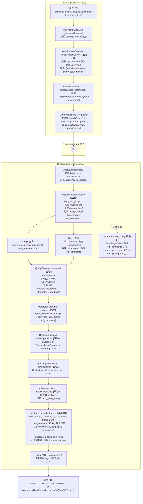

过年是个好时候，可以猛猛干活或者看论文。不过上了几天磨，看了几天论文后觉得还是需要整点活

所以这篇文章来聊聊一个经典话题，How to trace your SQL？

<!--more-->

## 正文

在 OpenTelementry 这一套开始铺展开来后，我们对于代码整个生命周期的 tracing 有了一个较为成熟的方案。包括各类 auto-instrumentation 的库，能够让我们在不修改代码的情况下就能对整个调用链进行 tracing。

但是始终有一朵乌云盘绕着 Tracing 世界的大厦上，我们怎么样将 SQL 的执行如同业务代码一样从黑盒中拆出来

在现阶段，我们对于整个 Tracing 的引入都是在做加法，我们选择构建一个 context，注入一些 metadata，让代码中不同的环节都可以获取到上下文。但是还是有一个问题，怎么样在 SQL 中做加法呢？

最直观的想法是，我们可以尝试一个类似机制

```sql
begin;
set saka.tracing_id = '1234567890';
select * from users where id = 1;
commit;
```

我们可以在 SQL 中设置一些 tracing_id 之类的东西，这样我们就可以在明确一个事务的上下文了。但是这个方案有一个问题，这会改变我们使用 SQL 的 pattern，我们需要在每个 SQL 语句前面都加上 set saka.tracing_id = '1234567890' 这样的东西，这样就会导致我们在代码中需要修改大量的 SQL 语句，这显然是不可行的。

那么另外一种方式实现的我们可以将 tracing 注入到 SQL 中，something like this:

```sql
select * from users where id = 1 /* tracing_id: 1234567890 */;
```

那么怎么做？

Google 提出了一个通用的方案 or 叫一个事实上的的标准吧，叫作 [SQLCommenter](https://google.github.io/sqlcommenter/)，它的核心思想就是通过 Hook ORM 等手段，让我们尽可能简单的在 SQL 中注入一些 comment，这些 comment 中包含了 tracing/Custom Tag 的信息，这样我们可以将元数据注入的成本降到最低。

那么我们来根据 SQLCommenter 的方案来看看我们怎么样在 Python 中实现这个功能，

以 pymysql 为例，我们需要实现这个非常简单

```python
from pymysql.cursors import SSCursor, SSDictCursor
from flask import g

from main.utils.context import INJECT_SQL_COMMENT, TRACE_ID
from main.utils.ip_utils import local_ip

try:
    CURRENT_IP = local_ip()
except:
    CURRENT_IP = "127.0.0.1"


def inject_meta_info(query: str) -> str:
    if INJECT_SQL_COMMENT.get():
        if TRACE_ID.get() != "None":
            trace_id = getattr(g, "TRACE_ID")
            sql_comment = f"/*X-Amzn-Trace-Id={trace_id}*/"
            query = f"{sql_comment} {query}"
    query = f"/*source_ip={CURRENT_IP}*/ {query}"
    return query


class CustomSSCursor(SSCursor):
    def execute(self, query: str, args: Any = None) -> int:
        return super(CustomSSCursor, self).execute(inject_meta_info(query), args)


class CustomSSDictCursor(SSDictCursor):
    def execute(self, query: str, args: Any = None) -> int:
        return super(CustomSSDictCursor, self).execute(inject_meta_info(query), args)

```

然后我们在使用时，注入自定义的 Cursor 就好了

Python 的生态还是幸福，但是很可惜，我现在是被迫在写 Node.js 的代码了，Node.js 的生态就没有那么幸福了。由于历史原因，我们现在用的是极为美味的 Prisma 作为 ORM。那么我们需要在 Prisma 来看一下怎么样注入 SQL Comment。

首先在 Prisma 最新的 v7.x 版本中，Prisma 本身实现了 SQLCommenter 的功能，something like this:

```ts
import { queryTags, withQueryTags } from "@prisma/sqlcommenter-query-tags";
import { PrismaClient } from "../prisma/generated/client";
const prisma = new PrismaClient({
  adapter,
  comments: [queryTags()],
});
// Wrap your queries to add tags
const users = await withQueryTags({ route: "/api/users", requestId: "abc-123" }, () =>
  prisma.user.findMany(),
);
```

最终会生成类似这样的 SQL

```sql
SELECT ... FROM "User" /*requestId='abc-123',route='/api/users'*/
```

OK， 很不错，是预期内行为

但是问题在于 Prisma V7 是一个极为屎一样的版本，我们完全无法如品鉴母鸡卡一样品鉴这个功能。因为性能问题（v7 比 v6 慢了 30%-40%），我们完全无法在生产环境中使用 v7 的版本，所以我们只能在 v6 中实现这个功能了。

在 Prisma v6 中，Prisma 数据映射部分和核心的 Query Engine 是完全分开，他们通过走 NAPI-RS 进行通信，而他们自定义了一套 json based 的传输协议，协议样例如下

```json
  {
    "modelName": "User",                    // 可选，raw query 不需要
    "action": "findMany",                   // 操作类型
    "query": {                              // 查询详情
      "arguments": {                        // where/orderBy/take 等
        "where": { "email": { "contains": "prisma.io" } }
      },
      "selection": {                        // 字段选择
        "$scalars": true,
        "$composites": true,
        "posts": {                          // 关联查询嵌套
          "arguments": {},
          "selection": { "$scalars": true }
        }
      }
    }
  }
```

而在这一次，我想实现类似官方的语义

```ts
    return this.prisma.post.findMany({
      take: 100,
      sqlComments: getSqlComments(req),
    });
```

OK，那么我们直接用一个流程图来输出一下对应的实现流程



OK，在调整完 FFI ，扩展完 Query Engine 后，我们再调整一下 Prisma 代码生成相关的部分即可

然后我们可以在业务代码中这样使用

```ts
function getSqlComments(req: Request): Record<string, string> {
  const comments: Record<string, string> = {};

  // Request info
  comments.route = req.path;
  comments.method = req.method;
  if (req.route?.path) {
    comments["route_pattern"] = req.route.path;
  }

  // OpenTelemetry trace context
  const span = trace.getSpan(context.active());
  if (span) {
    const ctx = span.spanContext();
    comments.traceparent = `00-${ctx.traceId}-${ctx.spanId}-0${ctx.traceFlags}`;
  }

  return comments;
}

@Controller()
export class AppController {
  constructor(private readonly prisma: PrismaService) {}

  @Get()
  getHello(): string {
    return `Hello World!`;
  }

  @Get("posts")
  getPosts(@Req() req: Request) {
    return this.prisma.post.findMany({
      take: 100,
      sqlComments: getSqlComments(req),
    });
  }

  @Get("posts/:id")
  getPostsById(@Param("id") id: string, @Req() req: Request) {
    return this.prisma.post.findUnique({
      where: { id },
      sqlComments: getSqlComments(req),
    });
  }

  @Get("posts-with-comments")
  getPostsWithComments(@Req() req: Request) {
    return this.prisma.post.findMany({
      take: 100,
      include: {
        comments: true,
      },
      sqlComments: getSqlComments(req),
    });
  }

  @Get("posts-with-comments/:id")
  getPostWithCommentsById(@Param("id") id: string, @Req() req: Request) {
    return this.prisma.post.findUnique({
      where: { id },
      include: {
        comments: true,
      },
      sqlComments: getSqlComments(req),
    });
  }

  @Post("posts")
  createPost(@Body() body: { title: string; body: string }, @Req() req: Request) {
    return this.prisma.post.create({
      data: {
        title: body.title,
        body: body.body,
      },
      sqlComments: getSqlComments(req),
    });
  }
}
```

然后我们可以得到这样的 SQL 

```text
2026-02-22 07:56:38.681 GMT [190] LOG:  execute s412381: SELECT "public"."Post"."id", "public"."Post"."title", "public"."Post"."body", "public"."Post"."createdAt", "public"."Post"."modifiedAt" FROM "public"."Post" WHERE ("public"."Post"."id" = $1 AND 1=1) LIMIT $2 OFFSET $3 /* method='GET',route='%2Fposts%2Fff4ccd6d-2c15-4979-a5f3-0c27e4e2f169',route_pattern='%2Fposts%2F:id',traceparent='00-e984180b391935fbdf2b1e1f6f3b2b12-1286ff6754fbbc57-01' */
2026-02-22 07:56:38.681 GMT [190] DETAIL:  parameters: $1 = 'ff4ccd6d-2c15-4979-a5f3-0c27e4e2f169', $2 = '1', $3 = '0'
2026-02-22 07:56:38.681 GMT [190] LOG:  execute s412382: SELECT "public"."Post"."id", "public"."Post"."title", "public"."Post"."body", "public"."Post"."createdAt", "public"."Post"."modifiedAt" FROM "public"."Post" WHERE ("public"."Post"."id" = $1 AND 1=1) LIMIT $2 OFFSET $3 /* method='GET',route='%2Fposts%2Fff4ccd6d-2c15-4979-a5f3-0c27e4e2f169',route_pattern='%2Fposts%2F:id',traceparent='00-fa7f8686b25c2efe8942718207c28079-bbeb59140c47895c-01' */
2026-02-22 07:56:38.681 GMT [190] DETAIL:  parameters
```

通常来说，这样的语句已经能在我们常见的数据库调试流程中已经起到很大的帮助了，可以查到某一条慢 SQL 的来源，上下文等信息

但是这就够了吗？我们能不能把数据库也接入到 OpenTelemetry 的 tracing 体系中来呢？我们能不能在数据库的层面上看到整个调用链的 tracing 信息呢？

那没有问题的，这里以我现在更熟悉一点的 PostgreSQL 生态举个例子

Datadog 之前有一个工作，他们在 PostgreSQL 上实现了一个扩展叫作 pg_tracing <https://github.com/DataDog/pg_tracing>

通过使用 PostgreSQL 的一些扩展点

1. post_parse_analyze_hook
2. planner_hook
3. ExecutorStart_hook
4. ExecutorRun_hook
5. ExecutorFinish_hook
6. ExecutorEnd_hook
7. ProcessUtility_hook
8. xact_callback

然后配合一些环形缓冲区和共享内存，就可以在数据库层面上实现一个 tracing 的功能了，这样我们就可以将 PostgreSQL 接入到 OTEL 生态中了。当然这个库的实现里面有不少小技巧，改天可以单独写个文章来聊聊

MySQL 虽然内部的实现是一坨，但是我想如果要在 MySQL 上实现类似的功能应该工作量也不会太大，

最终的效果如下所示


差不多就这样

## 总结

大家都在写各种 AI/Agent 的文章的时候，我还在搞点这种 old school 的东西。恍惚间看到我的前方有一个巨大的风车。But anyway， 我喜欢这些东西， 这就够了

祝大家看的开心。
