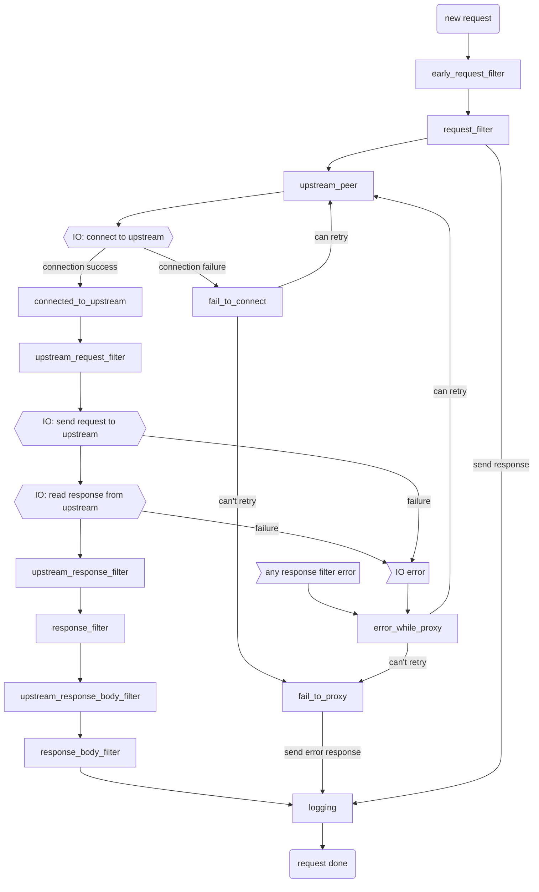

# 2024 年第 39 周周报

## 生活

开始提前进入假期状态（

1. 本周的状态
    1. 整体情况稳定
    2. 不过早睡怎么就早睡不了呢！
2. 小狗小猫最近终于稳定不少了，开心！我家小狗真的是太可爱了！
3. 本周的娱乐时间
    1. 本周的番剧
        1. 亚刻又开始神鬼二象性了，最近的香槟开不起来了呜呜呜
        2. 这周还在复习老奥特曼，我也是光！
        3. 重新看白箱剧场版，可爱捏
    2. CS：我终于又上 C 了！
    3. 异常生物见闻录和黎明之剑真是百看不厌啊！
    4. 大眼珠子又开新书了，先送个盟主
4. 本周在看敦煌的女儿，好看
5. 本周继续背单词

## 技术

1. 这周还在说服社区去接受给 multiprocessing 新加一个原语
2. 最近写 chibicc 的时候顿悟了不少 CSAPP 里的东西
3. chibicc 的数组的 part 写完了！
4. 这周又在看 WASI 的东西，突然感觉成熟了不少，感觉可以自己写一些比较有趣的东西
5. <https://github.com/k3s-io/kine> K3S 出的一个可以把 ETCD 扬了的东西，很有趣
6. <https://github.com/abersheeran/baize> 一个 Python ASGI 的工具集，很好用，推荐！
7. 本周继续刷题

差不多就这样

## 总结

马上又是国庆假期了，开心
